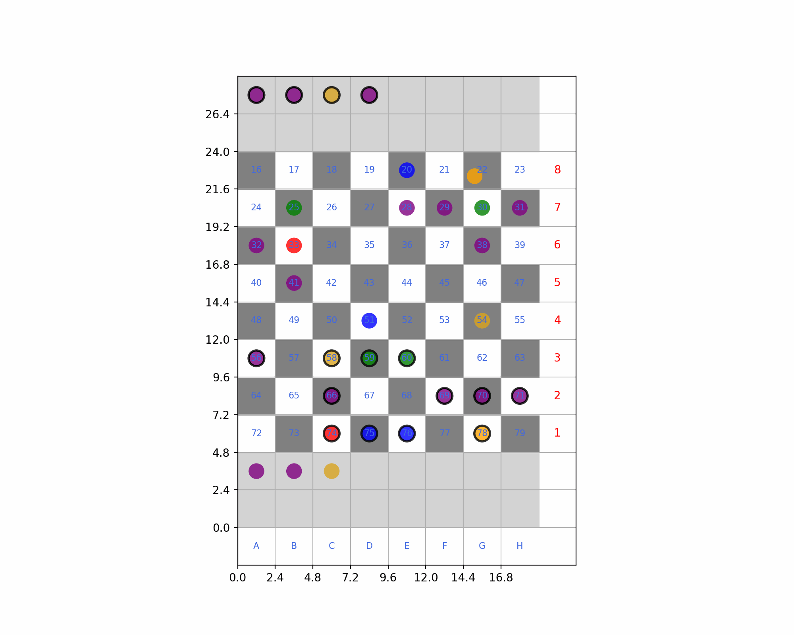
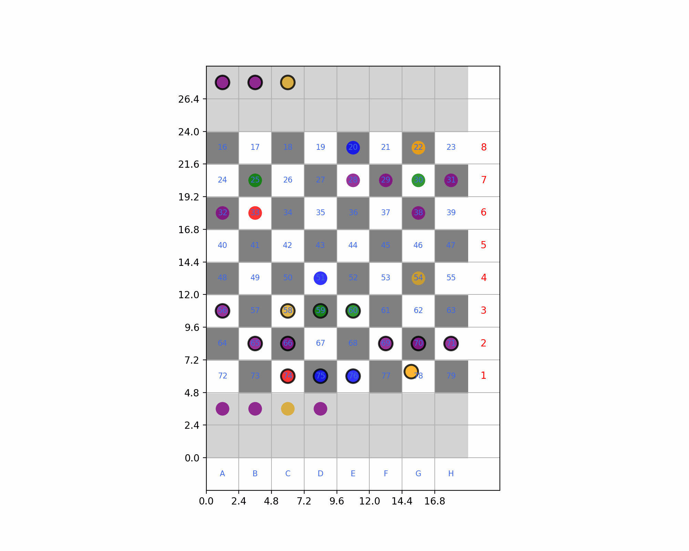

# Chess Piece Movement Simulator Using CLF and CBF

## Description
This project presents a unique simulation of chess piece movements using Control Lyapunov Functions (CLF) and Control Barrier Functions (CBF). The simulation disregards conventional chess rules, focusing instead on the movement and interactions of pieces on the board. This approach is particularly relevant in game theory and robotics for applications like path planning and obstacle avoidance.

## Features
- **Control Lyapunov Function (CLF)**: The simulation uses a CLF defined as \( V = ||x - x_{goal}||^2 \), where \( x_{goal} \) is the goal position and \( x \) is the current position of the moving piece. In the code, this is implemented as `V = (x_current[0]-self.goal[0])**2 + (x_current[1]-self.goal[1])**2`.
- **Control Barrier Function (CBF)**: A barrier function is used to avoid collisions with obstacles (other chess pieces). The function is defined as \( h = ||x - x_{obs}||^2 - (Obs_{rad} + x_{rad} + 0.1)^2 \), where \( x_{obs} \) is the obstacle position, \( Obs_{rad} \) is the obstacle's radius, and \( x_{rad} \) is the radius of the moving piece. The code representation is `h = (x_current[0]-pos[0])**2 + (x_current[1]-pos[1])**2  - (rad + x_current_radius+ 0.1)**2`.
- **Capturing Mechanism**: Any piece can capture any other piece on the board, focusing on the simulation of movement rather than adhering to standard chess rules.
- **Color Representation**: Each type of chess piece is represented by a unique color:
  - King: Orange
  - Queen: Red
  - Rook: Blue
  - Bishop: Green
  - Knight: Goldenrod
  - Pawn: Purple

## Board Configuration
- The board is divided into grid positions, with `grid_positions[16]` to `grid_positions[79]` representing the standard 8x8 chessboard.
- Captured pieces are moved to specific areas on the board: `grid_positions[0]` to `grid_positions[15]` for Player 1's captured pieces and `grid_positions[80]` to `grid_positions[95]` for Player 2's captured pieces.
- Users can adjust the 'position', 'radius', 'type', and 'player' attributes of each piece for custom configurations.

## Usage
The primary variables for the simulation are `moving_piece_notation` and `goal_notation`:
- `moving_piece_notation`: Specifies the chess piece to move, using standard chess notation.
- `goal_notation`: Specifies the target square for the piece to move to, also in standard chess notation.
- If a target square is occupied, it implies a capture, and the captured piece is moved to the designated captured pieces area, represented by light grey squares.

## Dependencies
- Gurobi Optimizer
- NumPy
- Matplotlib

## Author
Idris Seidu

---

## How to Run
1. Install the required dependencies.
2. Modify the `moving_piece_notation` and `goal_notation` in the script to set up the desired movement simulation.
3. Run the script to visualize the chess piece movements and interactions on the board.

, 

For more detailed instructions and examples, refer to the provided documentation within the script.

